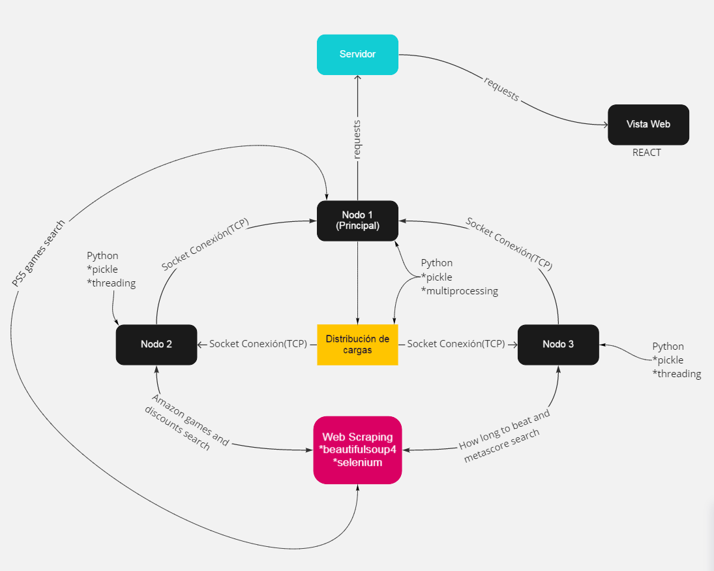

# Operating Systems

## Diagrama de arquitectura 

  

### Pasos para ejecutar el proyecto

**Cada carpeta es un proyecto diferente, en cada uno de los proyectos se encuentra un archivo README.md donde se explica como instalar cada modulo y sus dependencias**

1. Se requiere que se ejecute el archivo **server.py** que se encuentra dentro de la carpeta con el nombre de **Servidor**
2. Se requiere que se ejecute el archivo **nodo_secundario_1.py** que se encuentra dentro de la carpeta con el nombre de **Nodo_Secundario_1**
3. Se requiere que se ejecute el archivo **nodo_secundario_2.py** que se encuentra dentro de la carpeta con el nombre de **Nodo_Secundario_2**
4. Se requiere que se ejecute el archivo **nodo_principal.py** que se encuentra dentro de la carpeta con el nombre de **Nodo_Principal**
